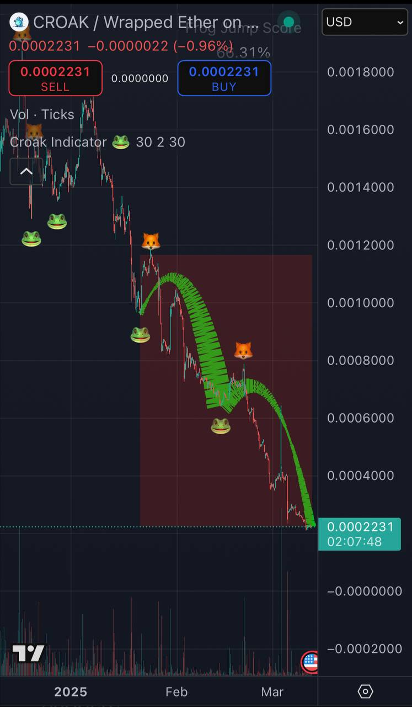
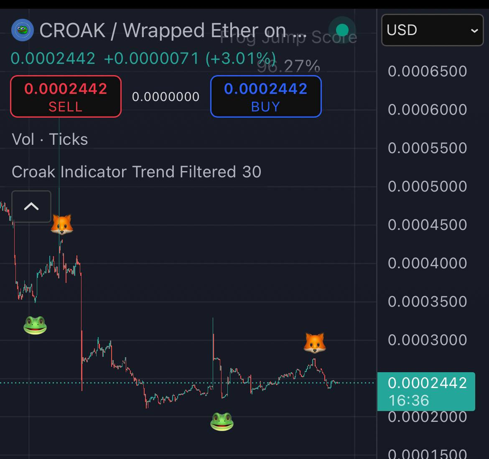

# 🐸 Croak Indicator – Trend-Aware Market Structure Visualizer

## 🔍 Overview
The **Croak Indicator** is a visual, meme-powered market structure tool designed for the $CROAK community on **Linea**. It identifies potential **swing highs and lows** and plots them with intuitive icons:

- 🐸 Frog → Possible bottom reversal in an uptrend
- 🦊 Fox → Possible top reversal in a downtrend

This indicator is a **community-themed charting tool**, created to make technical analysis more fun and visual for crypto traders — especially those in meme or grassroots token ecosystems.

---

## ✨ What's New in This Version

This is an **improved version** of the original viral Croak Indicator on TradingView, now with:

✅ **EMA trend filtering** (EMA 21/50)  
✅ **Alternating signal logic** (Frog → Fox → Frog)  
✅ **De-duplication** (no stacked signals)  
✅ **Cleaner, repaint-aware logic**  
✅ **Improved performance & readability**

> This version focuses on structure learning and clarity — not just memes, but meaningful market visuals.

---

## 🧪 Original Version (V1)

The first version of the Croak Indicator gained **thousands of views** on TradingView and helped meme traders spot structure with colorful arcs and emoji signals.

It featured:
- 🟢/🔴 bezier arcs to visualize jumps and drops
- 🐸/🦊 plotted at reversal areas
- No trend filter or alternation logic

### 📸 Screenshot – Original Version

---

## 🚀 New Version (Trend-Filtered & Smarter)

The current version removes arcs and backgrounds to reduce noise and adds smarter logic to keep signals accurate and spaced.

### 📸 Screenshot – Current Version

---

## 💡 How It Works

- Uses local high/low structure detection over a defined period (`Pattern Length`)
- Applies **EMA crossover** logic to filter trends:
  - 🐸 Frog only appears when `EMA 21 > EMA 50` (uptrend)
  - 🦊 Fox only appears when `EMA 21 < EMA 50` (downtrend)
- Alternates signals to reduce confusion and improve usability
- Optional **Frog Jump Score** UI to assess swing symmetry

---

## 📈 Try It on TradingView
[🔗 View the Croak Indicator – Trend Filtered](https://www.tradingview.com/script/npMbt9iy-Croak-Indicator-Trend-Filtered/)

---

## ⚠️ Disclaimer
This script is provided for **educational and informational purposes only**. It is a **repainting indicator** and is **not meant for real-time trade execution**. Always perform your own research and risk management.

---

## 🛠️ Credits
Created for the **@CROAK_on_Linea** community as part of the **Linea Dev Cookoff Hackathon** (CROAK Track).

This is a **community-themed charting utility**, built to help $CROAK holders visualize structure and vibe with the charts 🐸📈.

